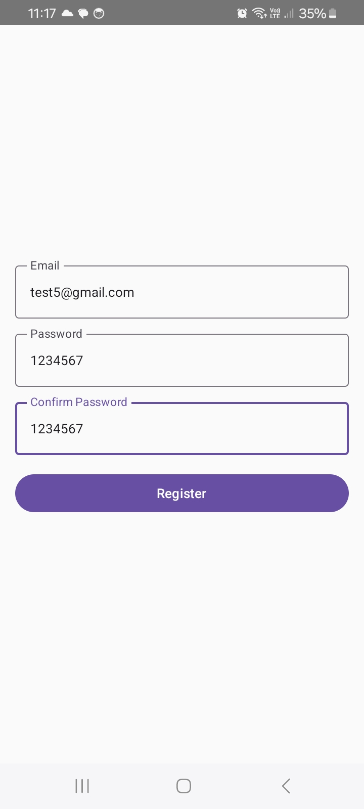
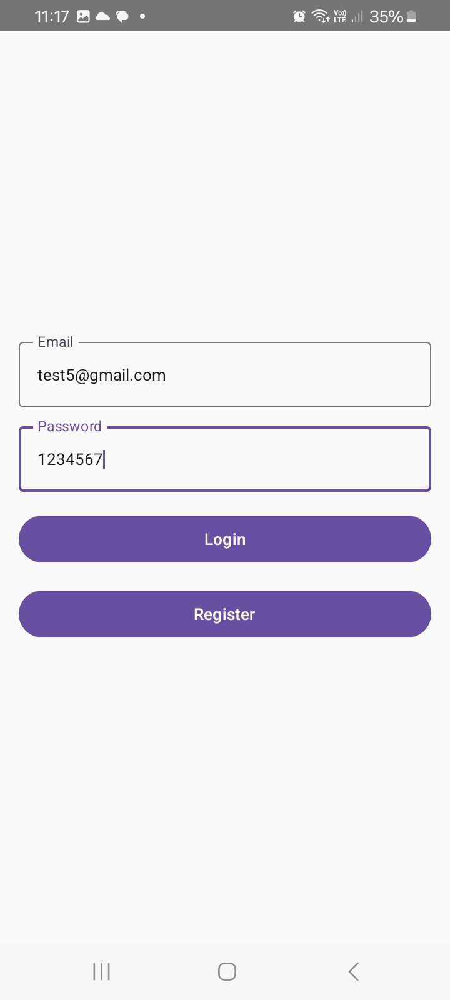
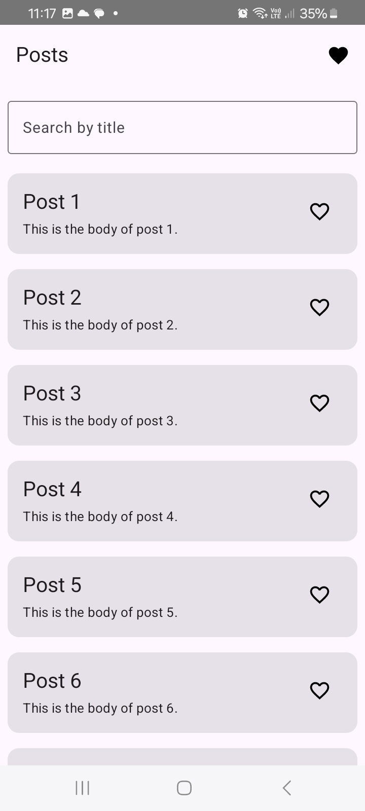
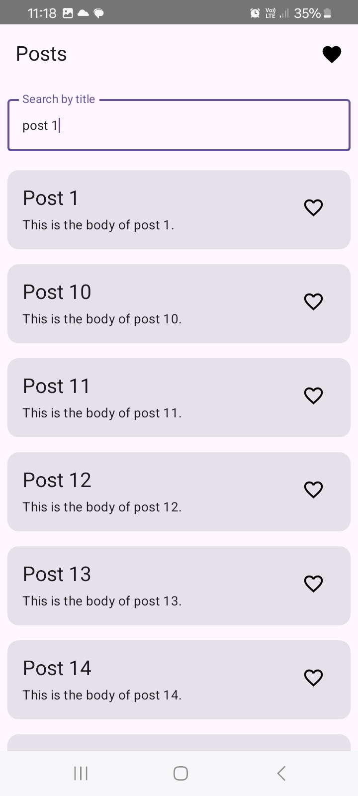
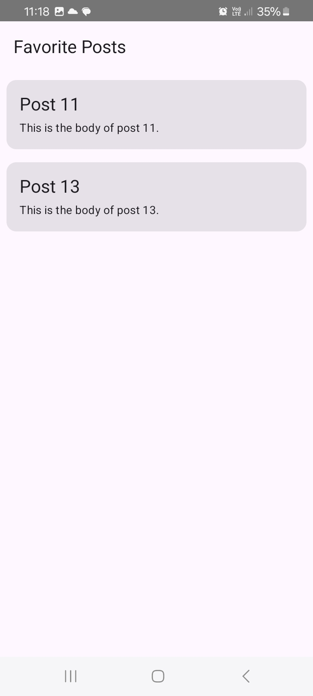

# Assessment App

An Android application built with **Jetpack Compose**, **Room**, **Retrofit**, and **Hilt** for dependency injection. This app demonstrates **lazy-loaded posts**, **search functionality**, **pull-to-refresh**, and **favorites management**.

---

## Description

This app allows users to view posts fetched from a remote API with pagination and search functionality. Users can mark/unmark posts as favorite, and favorite status is stored locally using Room. A separate screen displays all favorite posts.

---

## Features

### 1. User Authentication
- **Registration:** Users can register with email and password.
- **Login:** Users can log in using registered credentials.
- Input validation: Ensures correct email format and password confirmation.

### 2. Post Listing with Lazy Loading
- Displays posts fetched from a remote API (JSONPlaceholder or similar).
- Implements **lazy loading** to fetch posts in chunks (pagination) instead of loading all at once.
- Automatically loads the next set of posts when the user scrolls near the bottom.

### 3. Pull-to-Refresh
- Users can **pull down from the top** of the post list to refresh data.
- Works seamlessly with lazy loading and search results.

### 4. Search Posts by Title
- Search field at the top of the post list.
- **Live search**: Filters posts as the user types (debounced to reduce API calls).
- Works offline and online (searches in cached Room data as well).

### 5. Favorites Management
- Each post has a **favorite icon** that can be toggled.
- Favorite status is stored locally in the `isFavorite` column of the posts table.
- Users can mark/unmark posts as favorites.
- Favorite posts are displayed in a **separate screen**.

### 6. Offline Support
- Previously loaded posts are cached in **Room database**.
- Cached posts are available offline and reflect favorite status.

### 7. Clean Architecture & MVVM
- **ViewModel** handles UI state and business logic.
- **Repository** handles data fetching and caching.
- **Room + Retrofit** integration with Hilt for dependency injection.

### 8. Modern Android Development
- Built entirely with **Jetpack Compose** for UI.
- Uses **Material3** design components.
- Navigation implemented using **Jetpack Compose Navigation**.

---

## Screenshots

| Login | Register | Post List |
| :---: | :---: | :---: |
|  |  |  |
| Search | Favorite List | |
|  |  |  |

---

## **Demo Video**
You can watch the PoseGuard demo video here:

- [Demo Video on Loom](https://www.loom.com/share/a5e2c671ec2f4e48a1755933c2cba517?sid=51869c46-0db5-4861-b1cc-aa45562bc60c)

---

## Tech Stack

| Layer | Library / Tool |
|-------|----------------|
| UI | Jetpack Compose, Material3 |
| Network | Retrofit, Kotlin Coroutines |
| Local Storage | Room Database |
| Dependency Injection | Hilt |
| Architecture | MVVM |
| Navigation | Jetpack Compose Navigation |
| Gradle | Kotlin DSL |

---

## Database Schema

**Post Table (`posts`)**

| Column      | Type    | Description                        |
|------------|--------|------------------------------------|
| id         | Int    | Post ID (Primary Key)              |
| title      | String | Post title                         |
| body       | String | Post body                          |
| isFavorite | Boolean| Whether the post is marked favorite|

**Note:** Favorites are stored in the same table using the `isFavorite` column.

---

## Notes

- Offline support: Posts previously loaded are cached locally using Room.
- Favorite feature: Simple toggle stored in the posts table (`isFavorite` column).
- Pull-to-refresh: Works from the top of the list, including search results.
